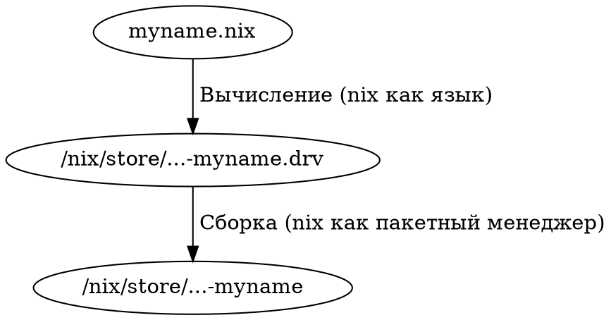
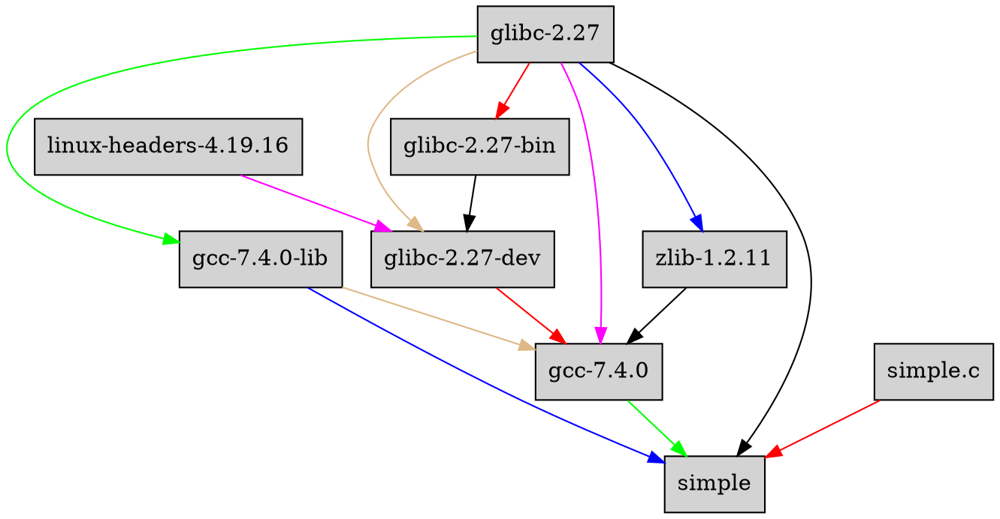

<!--
<meta charset="utf8" />
<title>Заметки выступающего</title>
# Заметки выступающего
-->

# Вступление

Основано на <https://nixos.org/nixos/nix-pills> . Огромная благодарность @Lethalman и @grahamc за написание и поддержку этого материала!

Я хотел бы, чтобы к концу презентации всем стало понятно

* Что такое Nix
* Как собрать пакеты из `contractor` с помощью nix
* Что находится в `contractor/nix/pkgs`
* Что находится в `contractor/nix/overlay.nix`
* Как писать несложные выражения на nix, не совершая неочевидных ошибок

Вы можете прекратить слушать после любой секции, и я надеюсь, что вы унесете какую-то полезную для себя информацию.


<!-- 
Как вы все скорее всего знаете, мы используем Nix для сборки и тестирования нашего кода. Я, Александр Бантьев (@balsoft) отвечаю за инфраструктуру сборки пакетов (Hydra, NixOps), а также за поддержание инструкций сборки в актуальном состоянии. Я бы хотел рассказать вам про nix с помощью вольного пересказа отличной серии статей ["Nix pills"](https://nixos.org/nixos/nix-pills)
-->

## Что такое nix?

<!-- 
Говоря "Nix", мы подразумеваем одну из двух его ипостасей -- Nix как язык или Nix как пакетный менеджер. Такая путаница возникла из-за того, что как DSL Nix имеет смысл только в связке со своим пакетным менеджером, а как пакетный менеджер он без своего языка слишком сложен в использовании, и Eelco Dolstra (создатель Nix) решил не разделять их.
-->

[Nix](https://nixos.org/nix) -- это

#. Язык
   + Декларативный
   + Функциональный
   + Чистый
   + Ленивый
   + Динамически типизированный
#. Пакетный менеджер
   + Атомарный
   + Повторяемый
   + Source/Binary


## Экосистема

<!-- 
Nix довольно быстро стал широко известен в узких кругах, и вокруг него возникла большая экосистема декларативных, атомарных инструментов, в том числе:

*  nixpkgs, репозиторий описаний пакетов на языке nix;
*  NixOS, дистрибутив GNU/Linux с интересным подходом к конфигурации системы;
*  NixOps, инструментарий для разворачивания виртуальных машин и приложений на них на базе NixOS;
*  Hydra, CI -- сервер;
*  Disnix, система для разворачивания распределенных систем.
-->

```{.graphviz layout=fdp}
digraph {
    graph [ dpi = 200; font = Hack; ];
    subgraph cluster_nix {
        "nix (пакетный менеджер)" -> "nix (язык)";
        "nix (язык)" -> "nix (пакетный менеджер)";
        color = blue;
    }
    cluster_nix -> Disnix;
    cluster_nix -> Hydra;
    cluster_nix -> nixpkgs -> NixOS -> NixOps;
}
```


# Nix как пакетный менеджер

> Nix is a powerful package manager for Linux and other Unix systems that makes package management reliable and reproducible. It provides atomic upgrades and rollbacks, side-by-side installation of multiple versions of a package, multi-user package management and easy setup of build environments.

*--- nixos.org/nix*

<!--
На https://nixos.org/nix заявлено, что nix -- это все-таки пакетный менеджер. С этого компонента мы и начнем.
-->

## Хранилище (nix store)

<!--
Центральным местом файловой системы для Nix является Хранилище (nix store). Именно здесь хранятся все файлы, с которыми оперирует наш пакетный менеджер: инструкции сборки и её результаты -- исполняемые файлы, документация, заголовочные файлы, etc.

Все элементы директории `/nix/store` имеют одинаковый формат имени -- `<hash>-<name>[-version][-output]`. Хэш вычисляется при добавлении в хранилище или при сборке на основе содержимого файла либо содержимого деривации (инструкции сборки), из которого этот путь был собран.
-->


> In the beginning was the Store, and the Store was with Nix, and the Store was Nix. 

*--- Nix manual, 1:1*


```bash 
$ ls /nix/store | wc -l
46251
$ nix add-to-store nix.conf
/nix/store/za34q8y0jcx3qsrnbrd005mh8zcnlrlr-nix.conf
```
### Формат имени
```
<hash>-<name>[-version][-output]
```
Например,
```
/nix/store/04mm93j20jlnwvhh21db674b3vy6fs54-pandoc-2.7.1-data
          |              hash              | name | ver | out |
```
    
## Принцип работы

<!-- 
В общих чертах, получение результата любого выражения (в терминологии ПМ -- пакета) на nix состоит из двух этапов -- вычисления (за это отвечает nix как язык), и сборки -- именно эта часть ложится на плечи nix как пакетного менеджера.
-->



## Деривации (derivations, `.drv` files)

<!--
Для сборки пакетов любому пакетному менеджеру нужны инструкции. Например, ABS (Arch build system) использует PKGBUILD, portage (Gentoo) использует EBUILD, brew использует recepies. Nix не является исключением, и для сборки он использует Деривации (.drv). Пример деривации (с добавленными мною переносами строки и пробелами для улучшения читаемости) -- на слайде.
-->


### `/nix/store/z3hhlxbckx4g3n9sw91nnvlkjvyw754p-myname.drv`
```
Derive
([("out"
  ,"/nix/store/40s0qmrfb45vlh6610rk29ym318dswdr-myname","","")]
,[]
,[]
,"mysystem"
,"mybuilder"
,[]
,[("builder","mybuilder")
 ,("name","myname")
 ,("out","/nix/store/40s0qmrfb45vlh6610rk29ym318dswdr-myname")
 ,("system","mysystem") ] )
```

## Краткая справка по инструментарию
### Собрать (build/realize) деривацию
```
$ nix-store -r /nix/store/z3hhlxbckx4g3n9sw91nnvlkjvyw754p-myname.drv
```
### Вычислить (evaluate) и затем собрать содержимое файла `default.nix`
```
$ nix build -f default.nix # или nix-build default.nix
```
### Вычислить, собрать и запустить интерактивное окружение
```
$ nix run -f default.nix # или nix-shell default.nix
```

# Nix как язык

<!--
В общих чертах разобравшись с пакетным менеджером, перейдем к языку. Большая часть синтаксиса, конструкций и идей будет знакома вам по другим языкам, поэтому мы быстро пробежимся по примерам, останавливаясь лишь на уникальных чертах и граблях, на которые легко наступить.
-->

Рассмотрим основы синтаксиса Nix.

Краткая инструкция для желающих повторить:
```bash
$ curl https://nixos.org/nix/install | sh
<...>
$ nix repl
```

## Числа, арифметика и комментарии
```
nix-repl> :t 4 # Показать тип выражения
an integer
nix-repl> 1 + 2 - 3 * 2
-3
nix-repl> 1 / 2
0
nix-repl> builtins.add 1 2
3
nix-repl> # Однострочный комментарий
nix-repl> /* Многострочный комментарий */
```
### Замечание
Арифметические операторы лучше обносить пробелами! У символов `/` и `-` есть особые значения в Nix
```
nix-repl> 6/2
/home/balsoft/6/2
```

## Булевы, булева арифметика и if
```
nix-repl> :t true
a boolean
nix-repl> true && false
false
nix-repl> true || false
true
nix-repl> if true || false then 3 else 4
3
nix-repl> if false then 5 else 6
6
```

## Строки (strings)
```
nix-repl> "foo"
"foo"
nix-repl> :t "foo"
a string
nix-repl> "Привет"
"Привет"
nix-repl> ''foo''
"foo"
nix-repl> ''
          foo
          bar
          ''
"foo\nbar\n"
```


## Переменные и стороковая интерполяция
```
nix-repl> foo = "hello"
nix-repl> "${foo}, world!"
"hello, world!"
```

### Замечание
Названия переменных могут содержать знак `-`
```
nix-repl> foo-bar = 10
nix-repl> foo-bar
10
```
Но не могут содержать не-ASCII!
```
nix-repl> привет
error: syntax error, unexpected $undefined, at (string):1:1
```

## Как избежать интерполяции?
Довольно часто встречаются ситуации, когда мы хотим вставить в строку последовательность `${...}` (например, в bash-код).

```
nix-repl> "\${foo}"
"${foo}"

nix-repl> ''test ''${foo} test''
"test ${foo} test"
```

## Пути (paths) и URL

```
nix-repl> /bin/sh
/bin/sh
nix-repl> :t /bin/sh
a path
nix-repl> ./hello # Относительно текущего .nix файла или PWD для repl
/home/balsoft/hello
nix-repl> https://typeable.io # Синтаксический сахар для строк
"https://typeable.io"
nix-repl> :t https://typeable.io
a string
```
### Замечание
Пути, как и названия переменных, не могут содержать не-ASCII. Я бы рассматривал это, как баг.
```
nix-repl> /home/balsoft/Документы
error: path '/home/balsoft/' has a trailing slash
```

## Списки (lists)

Списки в Nix иммутабельны и могут содержать значения любых типов вперемешку.

```
nix-repl> [ 2 "foo" true (2+3) ]
[ 2 "foo" true 5 ]

```

### Замечание
Обратите внимание: элементы списка не разделены запятыми!
```
nix-repl> [ 1 + 2 ]
error: syntax error, unexpected '+', at (string):1:5
nix-repl> [ (1 + 2) ]
[ 3 ]
nix-repl> [ import ./hello.nix {} ]
[ «primop-app» /home/balsoft/hello.nix { ... } ]
```

## Множества аттрибутов (attribute sets, attrsets)
```
nix-repl> s = { foo = "bar"; a-b = "baz"; "123" = "num"; }
nix-repl> s
{ "123" = "num"; a-b = "baz"; foo = "bar"; }
nix-repl> s.a-b
"baz"
nix-repl> s."123"
"num"
nix-repl> s.${toString (122 + 1)}
"num"
nix-repl> s.abc or "not found" # Note that `or` is a keyword
"not found"
nix-repl> s // { a = 10; }
{ "123" = "num"; a = 10; a-b = "baz"; foo = "bar"; }
nix-repl> rec { a = 3; b = a + 4; } # Recursive attrset
{ a = 3; b = 7; }
```


## Let, with и inherit
```
nix-repl> let a = 3; b = 4; in a + b
7
nix-repl> let a = 4; b = a + 5; in b # Let definitions are recursive
9
nix-repl> let a = 3; a = 8; in a
error: attribute `a' at (string):1:12 already defined at (string):1:5
nix-repl> longName = { a = 3; b = 4; }
nix-repl> with longName; a + b
7
nix-repl> let a = 10; b = 20; in { inherit a; b = b + 1; }
{ a = 10; b = 21; }
nix-repl> { inherit (s) "123" foo; }
{ "123" = "num"; foo = "bar"; }
```

## Функции (functions)
``` 
nix-repl> x: x*2
«lambda»
nix-repl> double = x: x * 2
nix-repl> :t double
a function
nix-repl> double 3
6
nix-repl> greet = end: name: "Hello, ${name} ${end}"
nix-repl> greet "dredozubov" "!"
"Hello, dredozubov !"
nix-repl> greetExclamaition = greet "!"
nix-repl> greetExclamaition "s9gf4ult"
"Hello, s9gf4ult !"
```

## Паттерн-матчинг
```
nix-repl> greet = { name, end }: "Hello, ${name} ${end}"
nix-repl> greet { name = "ak3n"; exc = "!"; }
"Hello, ak3n !"
nix-repl> greet = { name, end ? "!" }: "Hello, ${name} ${end}"
nix-repl> greet { name = "ak3n"; }
"Hello, ak3n !"
nix-repl> greet { name = "ak3n"; end = "."; }
"Hello, ak3n ."
nix-repl> greet = { name, end ? "!", ... }: "Hello, ${name} ${end}"
nix-repl> greet { name = "ak3n"; end = "."; extra = "foo"; }
"Hello, ak3n ."
nix-repl> foo = {a, ...}@args: args // { a = a + 3; }
nix-repl> foo { a = 10; b = 11; }
{ a = 13; b = 11; }
```

## Подключения файлов (import)
### `number.nix`
```
3
```
### `function.nix`
```
a: a + 3
```
### Обратно в наш уютный repl
```
nix-repl> a = import ./number.nix
nix-repl> f = import ./function.nix
nix-repl> f a
6
```

## Деривации (derivation)
<!--
Вот мы и подошли к моменту, когда мы можем сделать свою собственную деривацию! Исследуем встроенную функцию `derivation`. Она возвращает attrset, но nix показывает его как `derivation`. Странные дела!
-->
```
nix-repl> d = derivation {
            name = "myname"; 
            builder = "mybuilder"; 
            system = "mysystem"; }
nix-repl> :t d
a set
nix-repl> d
«derivation /nix/store/z3hhlxbckx4g3n9sw91nnvlkjvyw754p-myname.drv»
```
## Деривации: сборка
<!--
Как вы помните, деривации -- это инструкции сборки для nix. Попробуем собрать нашу фейковую деривацию. nix подсказывает, что у нас система не `mysystem`, а `x86\_64-
linux`. Исправим это и попробуем ещё раз. Теперь проблема в том, что файла `mybuilder`, который должен собрать наш пакет, не существует. Fail. Остановимся и исследуем `derivation` поподробнее.
-->
```
nix-repl> :b d
[...]
error: a `mysystem' is required to build ..., but I am a `x86_64-linux'
nix-repl> d = derivation { 
            name = "myname"; 
            builder = "mybuilder"; 
            system = builtins.currentSystem; }
nix-repl> :b d
[...]
[...]: executing 'mybuilder': No such file or directory
```
## Деривации: что внутри?
<!--
Так как derivation -- это обычный attrset, мы можем исследовать его аттрибуты с помощью встроенного инструментария. Заметим, что `drvAttrs` содержит аргументы, переданные в функцию `derivation`, `out` совпадает с самой деривацией (т.к. на данный момент у нашей деривации только один результат), ну и восхитимся магией типизации на аттрибутах (так вот почему nix так странно себя ведет, показывая derivation вместо сета!). Также заметим, что `toString` превращает в строки только те сеты, которые содержат аттрибут `outPath`.
-->
```
nix-repl> builtins.attrNames d
[ "all" "builder" "drvAttrs" "drvPath" "name" 
 "out" "outPath" "outputName" "system" "type" ]
nix-repl> d.drvAttrs
{ builder = "mybuilder"; name = "myname"; system = "x86_64-linux"; }
nix-repl> (d == d.out)
true
nix-repl> { type = "derivation"; } # Типизация истинных джентельменов
«derivation ???»
nix-repl> toString d
"/nix/store/qaq9ir9w2a34dzkjmk3igfbibi5q59sd-myname"
nix-repl> toString { outPath = "blah"; }
"blah"
nix-repl> toString { a = 10; }
error: cannot coerce a set to a string, at (string):1:1
```
## Деривации: добавляем зависимости
```
nix-repl> :l <nixpkgs> # nixpkgs -- это огромная куча дериваций!
Added 10082 variables.
nix-repl> coreutils
«derivation /nix/store/...-coreutils-8.30.drv»
nix-repl> toString coreutils
"/nix/store/...-coreutils-8.30"
nix-repl> d = derivation { 
            name = "myname"; 
            builder = "${coreutils}/bin/true"; 
            system = builtins.currentSystem; }
nix-repl> :b d
builder for '...-myname.drv' failed to produce output path '...-myname'
```
## Деривации: смотрим на зависимости
<!--
`nix show-derivation` показывает содержимое деривации в виде pretty-printed JSON. Как мы видим, у нас в зависимостях появилась ссылка на coreutils.drv, и builder стал указывать на true.
-->
```
$ nix show-derivation /nix/store/...-myname.drv
{
  "/nix/store/apvmj79y84wivsnjc2vkv2q79a37nf7l-myname.drv": {
    [...]
    "inputDrvs": {
      "...-coreutils-8.30.drv": [
        "out"
      ]
    },
    "builder": "...-coreutils-8.30/bin/true",
    [...]
  }
}
```

## Деривации: рабочая деривация!
<!--
Исправим ошибку, которая не дает нам получить нашу первую собирающуюся деривацию! Создадим скрипт `builder.sh`, который создаст outPath. Обратите внимание: мы не будем указывать hashbang для нашего скрипта, потому что даже сам исполняемый файл bash лежит в `/nix/store`, и путь к нему мы можем определить только из nix. Из-за невозможности добавить hashbang, будем запускать наш сборщик как `bash builder.sh`:
-->
### `builder.sh`
```bash
declare -xp
echo foo > $out
```

### Уютный `nix repl`
```
nix-repl> :l <nixpkgs>
Added 10082 variables.
nix-repl> d = derivation { 
            name = "foo"; 
            builder = "${bash}/bin/bash"; 
            args = [ ./builder.sh ]; 
            system = builtins.currentSystem; } 
nix-repl> :b d
this derivation produced the following outputs:
  out -> /nix/store/82jrv90z3aj1lmzr437jpp7m9krnrrzf-foo
```
## Деривации: посмотрим на env
<!--
Посмотрим на то, что показал `declare -xp` (т.е. на переменные окружения, которые доступны внутри сборщика). `nix log` показывает вывод сборщика при сборке определенного пути.

* `$HOME` указывает в пустой `/homeless-shelter`
* `$PATH` тоже пуст
* `$PWD` указывает во временную директорию `/build` (на самом деле она находистся в `/tmp`)

Замечу, что все аргументы derivation окажутся в env сборщика.
-->
```
$ nix log /nix/store/...-foo
[...]
declare -x HOME="/homeless-shelter"
declare -x NIX_BUILD_CORES="0"
declare -x NIX_BUILD_TOP="/build"
declare -x NIX_LOG_FD="2"
declare -x NIX_STORE="/nix/store"
declare -x PATH="/path-not-set"
declare -x PWD="/build"
declare -x TEMP="/build"
declare -x builder="/nix/store/...-bash-4.4-p23/bin/bash"
declare -x name="foo"
declare -x out="/nix/store/82jrv90z3aj1lmzr437jpp7m9krnrrzf-foo"
declare -x system="x86_64-linux"
```


## Деривации: опакетим простую программу на C
<!--
Теперь, когда мы умеем создавать рабочие деривации, добавлять зависимости и передавать произвольные переменные в env их сборщика, попробуем опакетить простую программу на C.
На этот раз вылезем из привычного `nix repl` и напишем файл!

Для сборки программы нам нужны coreutils (для создания выходной директории) и gcc (для сборки). К счастью, эти (и десятки тысяч других) приложения уже опакечены в nixpkgs. Передадим их деривации как аргументы нашему `derivation`, и они окажутся в env сборщика.
-->
### `simple.c`
```C
void main() {
  puts("Simple!");
}
```

### `simple_builder.sh`
```bash
export PATH="$coreutils/bin:$gcc/bin" # Переменные из derivation
mkdir -p $out/bin # Создадим выходную директорию
gcc -o $out/bin/simple $src # Соберем нашу программу
```
***
### `simple.nix`
```
with (import <nixpkgs> {});
derivation {
  name = "simple";
  builder = "${bash}/bin/bash";
  args = [ ./simple_builder.sh ]; # Сборщик
  inherit gcc coreutils; # Зависимости
  src = ./simple.c;
  system = builtins.currentSystem;
}
```
### Поехали!
```
$ nix build -f simple.nix
[1 built, 0.0 MiB DL]
$ ./result/bin/simple
Simple!
```
<!--
Успех!
-->


***
### Посмотрим граф зависимостей (`nix-store -q result --graph`)


# Стандартные паттерны в Nix. nixpkgs.
## `mkDerivation`
<!--
Итак, у нас есть мощный и специализированный язык, а также пакетный менеджер, который предоставляет удобную, изолированную среду для сборки пакетов. Для того, чтобы опакечивать софт было проще, создадим функцию, которая будет обобщать `derivation` и уменьшать бойлерплейт. Назовем эту функцию...
-->

Неудобства `derivation`

- Очень большая часть написанного кода будет повторяться из пакета в пакет
  * Распаковка (чаще всего достаточно `tar -xf`)
  * Добавление зависимостей (`gcc`, `coreutils`, `bash`, `awk`, `make`, ...)
  * Сборка (очень часто можно обойтись `./configure && make`)
  * Установка (`make install`)
- Требует как минимум два файла -- builder и expression
- После вычисления уже нельзя поменять отдельные аргументы, а это может быть удобно

Создадим свой `derivation` ~~c блекджеком и шлюхами~~ без этих недостатков!

## `mkDerivation`: зависимости и стандартный сборщик
<!--
Для начала, напишем сборщик в файле `generic-builder.sh`. Сначала поставим свой `$PATH`, собрав его из содержимого `buildInputs`. Затем распакуем архив, переданный нам в `$src` и перейдем в свежесозданную директорию. Там сконфигурируем, соберем и установим наш autotools-проект.
-->
### `generic-builder.sh`
```
set -e
unset PATH
for p in $buildInputs; do
  export PATH=$p/bin${PATH:+:}$PATH
done
tar -xf $src
for d in *; do
  if [ -d "$d" ]; then
    cd "$d"
    break
  fi
done
./configure --prefix=$out
make
make install
```
***
<!--
В nix-части напишем функцию, которая создает деривацию с нашим сборщиком и некоторыми пакетами по-умолчанию, которые будут полезны при создании любого пакета.
-->
### `generic-builder.nix`
```
{ buildInputs, pkgs, ... }@args:
with pkgs;
derivation (args // {
  buildInputs = buildInputs 
    ++ [ gnutar gzip gnumake gcc binutils-unwrapped 
         coreutils gawk gnused gnugrep ];
  builder = "${bash}/bin/bash";
  args = [ ./generic-builder.sh ];
})
```
